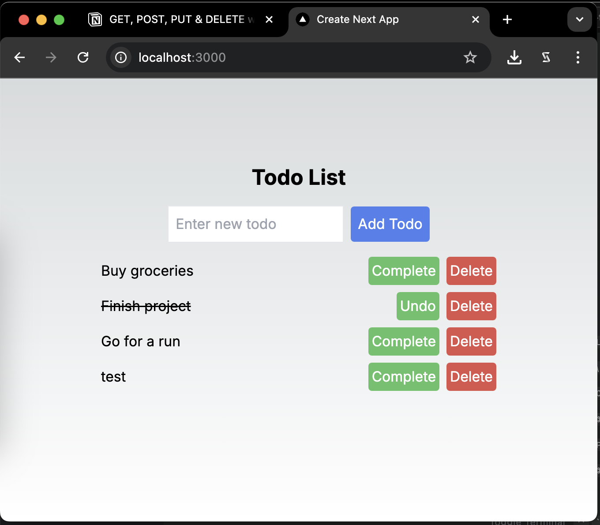

# Todo List App - Next.js App Router

Boilerplate code for API routes using **Next.js App Router** ([docs](https://nextjs.org/docs/app/building-your-application/routing/route-handlers)), for a todo-list CRUD (Create, Read, Update, Delete) application. The App Router supports both client-side and server-side rendering, allowing for complex routing and dynamic site content.



## Getting Started

First, clone the repository:

```sh
npx create-next-app@latest --example nextjs-app-router "https://github.com/spencerlepine/nextjs-app-router-todo"
```

Then, run the development server:

```sh
cd nextjs-app-router
```

```bash
npm run dev
# or
yarn dev
# or
pnpm dev
```

Open [http://localhost:3000](http://localhost:3000) with your browser to see the result.

## Endpoints

We’ll implement the following endpoints:

```jsx
GET /users/:userId/todos
POST /users/:userId/todos
PUT /users/:userId/todos/:itemId
DELETE /users/:userId/todos/:itemId
```

### GET

```tsx
// Next.js v14 App Router
// GET /users/:userId/todos
// app/api/users/[userId]/todos/route.ts
import { NextRequest, NextResponse } from "next/server"; // v14.x.x
import { todoItemDb } from "@/lib/db";

type TodoItem = {
  id: string;
  title: string;
  completed: boolean;
};

export const GET = async (
  req: NextRequest,
  { params, query }: { params: { userId: string }; query: {} }
) => {
  try {
    const { userId } = params;
    // const { limit, page } = query; // optional

    // Query the database
    const todoItems: TodoItem[] = await todoItemDb.getAll(userId);

    return NextResponse.json({ todoItems: todoItems }, { status: 200 });
  } catch (error) {
    console.error("Error processing request:", error);
    return NextResponse.json(
      { error: "Internal server error" },
      { status: 500 }
    );
  }
};
```

### POST

```tsx
// Next.js v14 App Router
// POST /users/:userId/todos
// app/api/users/[userId]/todos/route.ts
import { NextRequest, NextResponse } from "next/server"; // v14.x.x
import { todoItemDb } from "@/lib/db";

type TodoItem = {
  id: string;
  title: string;
  completed: boolean;
};

export const POST = async (
  req: NextRequest,
  { params }: { params: { userId: string } }
) => {
  try {
    const { userId } = params;
    const { title } = await req.json(); // request body

    if (!title) {
      return NextResponse.json(
        { error: "Invalid request body" },
        { status: 400 }
      );
    }

    // Handle your business logic here (e.g., update the database)
    const newTodoItem = await todoItemDb.createOne(userId, title);

    return NextResponse.json(newTodoItem, { status: 201 });
  } catch (error) {
    console.error("Error processing request:", error);
    return NextResponse.json(
      { error: "Internal server error" },
      { status: 500 }
    );
  }
};
```

### PUT

```tsx
// Next.js v14 App Router
// PUT /users/:userId/todos/:itemId
// app/api/users/[userId]/todos/[itemId]/route.ts
import { NextRequest, NextResponse } from "next/server"; // v14.x.x
import { todoItemDb } from "@/lib/db";

type TodoItem = {
  id: string;
  title: string;
  completed: boolean;
};

export const PUT = async (
  req: NextRequest,
  { params }: { params: { userId: string; itemId: string } }
) => {
  try {
    const { userId, itemId } = params;
    const todoItem = await req.json(); // request body

    if (!todoItem || typeof todoItem !== "object") {
      return NextResponse.json(
        { error: "Invalid request body" },
        { status: 400 }
      );
    }

    // Handle your business logic here (e.g., update the database)
    await todoItemDb.updateOne(userId, itemId, todoItem);

    return NextResponse.json({ success: true }, { status: 200 });
  } catch (error) {
    console.error("Error processing request:", error);
    return NextResponse.json(
      { error: "Internal server error" },
      { status: 500 }
    );
  }
};
```

### DELETE

```tsx
// Next.js v14 App Router
// DELETE /users/:userId/todos/:itemId
// app/api/users/[userId]/todos/[itemId]/route.ts
import { NextRequest, NextResponse } from "next/server"; // v14.x.x
import { todoItemDb } from "@/lib/db";

export const DELETE = async (
  req: NextRequest,
  { params }: { params: { userId: string; itemId: string } }
) => {
  try {
    const { userId, itemId } = params;

    await todoItemDb.deleteOne(userId, itemId);

    return NextResponse.json(
      { message: "Todo item deleted successfully" },
      { status: 200 }
    );
  } catch (error) {
    console.error("Error processing request:", error);
    return NextResponse.json(
      { error: "Internal server error" },
      { status: 500 }
    );
  }
};
```

## Data Fetching & Rendering

Now with the endpoints built, we're able to make requests to our backend. App Router will use server-side rendering by default.

### Client-side Rendering

If you have dynamic content or additional API requests from the frontend, add `"use client";` to pages (or components) and use `fetch` or `axios` .

```tsx
// Client-side rendering (CSR) - Next.js v14 App Router
// src/app/page.tsx

"use client";

export default async function HomePage() {
  const apiUrl =
    process.env.NEXT_PUBLIC_API_URL || "<http://localhost:3000/api>";
  const data = await fetch(`${apiUrl}/v1/user/mockUser123/todos`);
  const allTodoItems = await data.json();
  return (
    <ul>
      {allTodoItems.map((item) => (
        <li key={item.id}>{item.title}</li>
      ))}
    </ul>
  );
}
```

### Static Server-side Rendering

For static pages, use the default Next.js server-side rendering. This will be generated at build-time.

```jsx
// Server-side rendering (SSR) - Next.js v14 App Router
// src/app/page.tsx

import { db, todoItems } from "../../lib/db";

export default async function HomePage() {
  const allTodoItems = await db.select().from(todoItems);
  return (
    <ul>
      {allTodoItems.map((item) => (
        <li key={item.id}>{item.title}</li>
      ))}
    </ul>
  );
}
```

### Dynamic Server-side Rendering

To dynamically render pages (or components) at request time, set and export the `dynamic` configuration option.

```jsx
// Server-side rendering (SSR) - Next.js v14 App Router
// src/app/page.tsx

import { db, todoItems } from "../../lib/db";

// Render page request time
export const dynamic = "force-dynamic";

export default async function HomePage() {
  const allTodoItems = await db.select().from(todoItems);
  return (
    <ul>
      {allTodoItems.map((item) => (
        <li key={item.id}>{item.title}</li>
      ))}
    </ul>
  );
}
```

## Authentication

To secure page routes and endpoints in your application, consider using NextAuth.js ([repository](https://github.com/nextauthjs/next-auth)). You can either create your own custom login system and database or integrate with popular auth providers like Auth0 or Google.

## **Conclusion**

In this guide we covered the basic endpoints for CRUD (Create, Read, Update, Delete) API routes, along with data fetching for the frontend. This will be the bread and butter for most applications. To started today, find the example code over on GitHub: [https://github.com/spencerlepine/nextjs-app-router-todo](https://github.com/spencerlepine/nextjs-app-router-todo)

Thanks for reading. If you found the article useful don’t forget to **clap**. If you have any questions, feel free to reach out to me. Connect with me and follow my journey on 👉 👉 **[LinkedIn](https://www.linkedin.com/in/spencerlepine), [GitHub](https://github.com/spencerlepine)**
